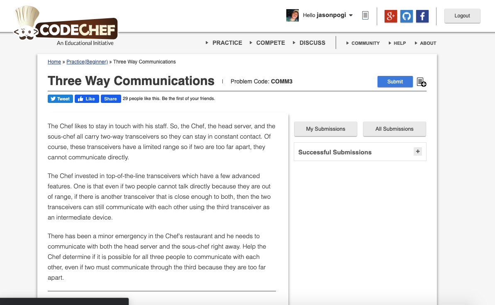

# Codechef-Three-Way-Communications
### Problem  

### Program Simulation
<pre>
  Sample Input
  2
  0 0
  0 2
  2 1

  Given:
  r = 2
  0 = a, 0 = b
  0 = c, 2 = d
  2 = e, 1 = f

  Process:
  n = 0
  close(0, -2, 2)
  return 0 + 4 <= 2 * 2 // TRUE
  n++ 
  n = 1
  close(-2, -1, 2)
  return 4 + 1 <= 2 * 2 // FALSE
  n = 1
  close(-2, 1, 2)
  return 4 + 1 <= 2 * 2 // FALSE

  if(1 > 1) print yes
  else print no

  Final Output:
  no
  </pre>
